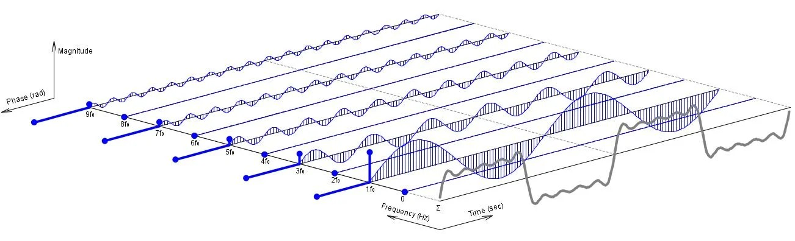
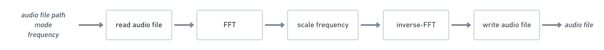
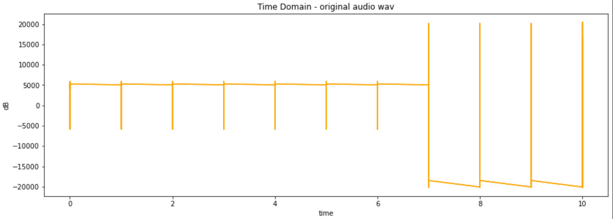
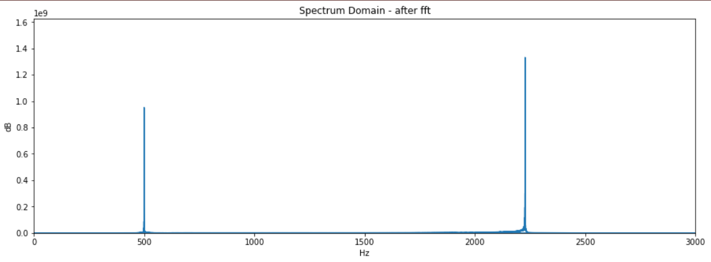
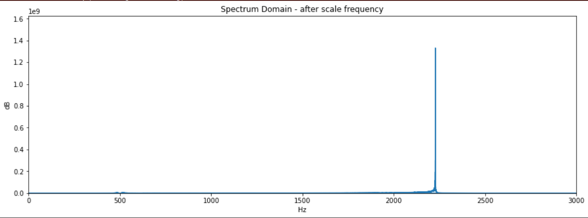
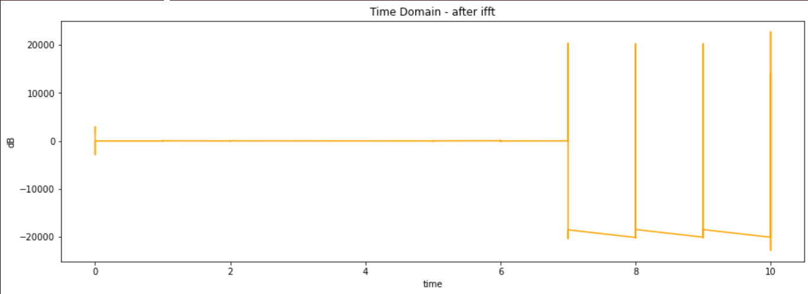

# Audio Enhancer

Audio Enhancer is a command-line tool that can scale specific frequencies in your audio.

## Problem to Solve

Equalization is the process of adjusting the volume of different frequency bands within an audio signal. Such as eliminating noise sounds or making certain voices more prominent.  

[Fourier Transform](https://en.wikipedia.org/wiki/Fourier_transform) can help us converts a signal from a time domain to a frequency domain. After obtaining the frequency series, adjust the volume of the frequency range according to the parameter.

Most equalizers are hardware, this program develops an online equalizer and uses the low-level language C++ to implement FFT and optimize it.

### Algorithm and Mathematics

- [Discrete Fourier Transform](https://en.wikipedia.org/wiki/Discrete_Fourier_transform) (DFT)  
    Signals we heard are continuous and non‑periodic. However, computers can not process infinite data.  DFT samples a continuous signal in the time domain, making the Fourier transform discrete in both the time and frequency domains.

    > 

- [Fast Fourier Transform](https://en.wikipedia.org/wiki/Fast_Fourier_transform) (FFT)  
    FFT is an algorithm that computes the DFT of a sequence, or its inverse (IDFT).  

    Computing DFT directly from the definition is too slow to be practical. FFT rapidly computes such transformations by factorizing the DFT matrix into a product of sparse factors. As a result, it reduces the complexity of computing the DFT from `O(N^2)` to `O(NlogN)`, which `N` is the data size.  

    - Cooley-Tukey FFT Algorithm  
        Cooley-Tukey Algorithm is the most common FFT algorithm which uses divide and conquer to recursively decompose a DFT of length N = N1N2 into two shorter sequences of length N1 and N2.
        > 

## Prospective Users

- Audio maker  
    Creators can use Audio Enhancer to scale the amplitude of a specific frequency.
## System Architecture

## API Description
`enhancer -F audio.wav -m debuff -f 1000`

- `file`: An audio file, allow type: `.wav`
- `mode`: Scale the specific frequency.
    - `gain`:   Double the amplitude of the frequency.
    - `debuff`: Remove the amplitude of the frequency.
- `freq`: A frequency position need to be scale. (unit: Hz)

User can use `enhancer --help` to read document.
## Engineering Infrastructure

- Automatic build system: `make`
- Version control: `git`
- Testing framework: `pytest`
- Documentation: Update to GitHub README.md
- Continuous integration: Github Action

## Schedule

Planning phase (6 weeks including 2/21, 2/28, 3/7, 3/14, 3/21, 3/28):

| Week         | Planning |
| :----------- | :------- |
| Week 1 (4/4) | Study Fourier Transform   Survey information and libraries |
| Week 2 (4/11) | Design system architecture |
| Week 3 (4/18) | Implement functions |
| Week 4 (4/25) | Implement functions   Write unit test|
| Week 5 (5/2) | Write unit test   Build Github Action (CI)|
| Week 6 (5/9) | Optimize execution performance |
| Week 7 (5/16) | Overall tests |
| Week 8 (5/23) | Prepare presentation   Write document |

## Results
The images below are the result of the audio in the time domain and spectrum domain after doing the enhancer.  
Test audio includes 500Hz and 2228Hz and the test goal is to eliminate 500Hz.  

- First, I read the .wav and draw the signal. 500Hz waveform for the first 7 seconds, 2228Hz for the last 3 seconds.
    
- Second, convert the signal from the time domain to the spectrum domain using FFT. You can see that there are two upright lines at 500Hz and 2228Hz. 
    
- Then, I scale the frequency, setting the value of 500Hz to 0.
    
- Finally, using inverse-FFT to bring signal back to the time domain, the 500Hz waveform is gone. 

## References

[Fast Fourier Transform](https://en.wikipedia.org/wiki/Fast_Fourier_transform)  
[What is the Fourier Transform? A visual introduction.](https://www.youtube.com/watch?v=spUNpyF58BY&ab_channel=3Blue1Brown)  
[WAV](https://zh.wikipedia.org/zh-tw/WAV)  
[Scipy/wavfile.py](https://github.com/scipy/scipy/blob/main/scipy/io/wavfile.py)  
[Online Tone Generator](https://www.szynalski.com/tone-generator/)